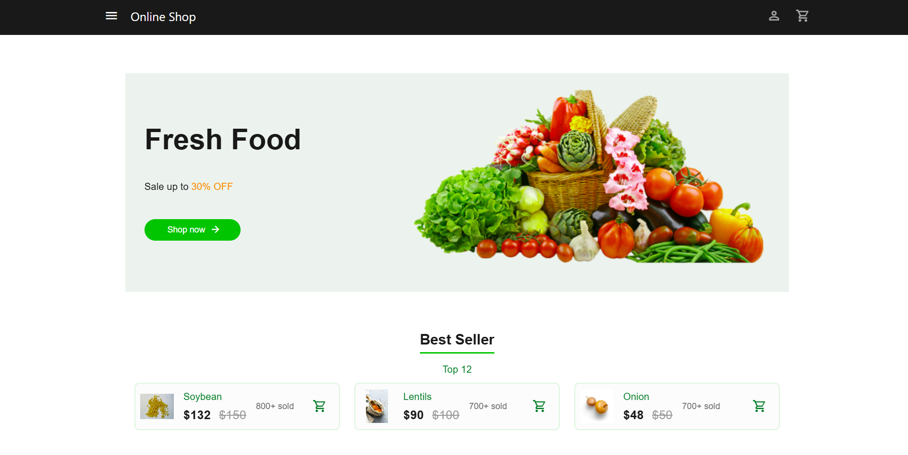
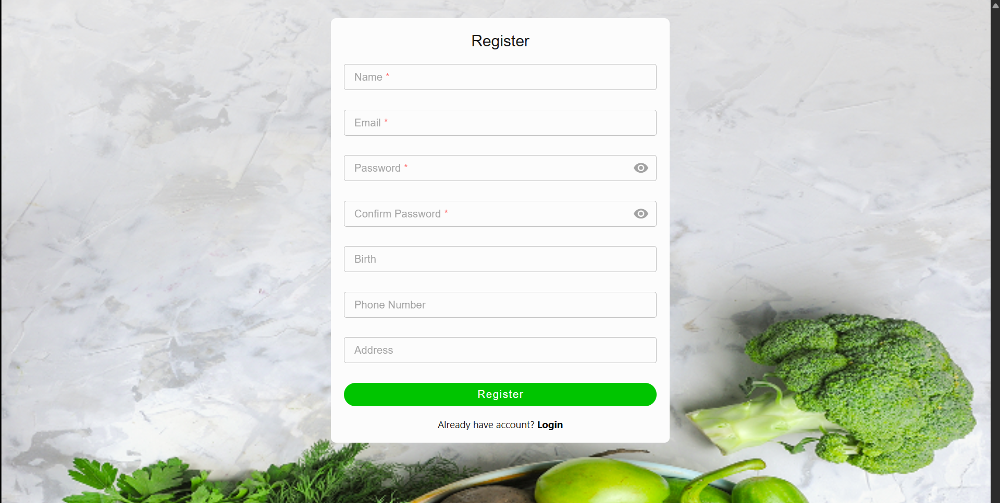
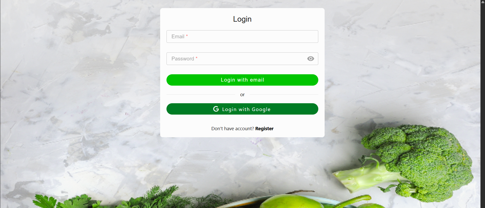
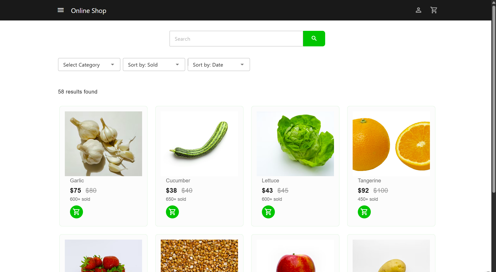
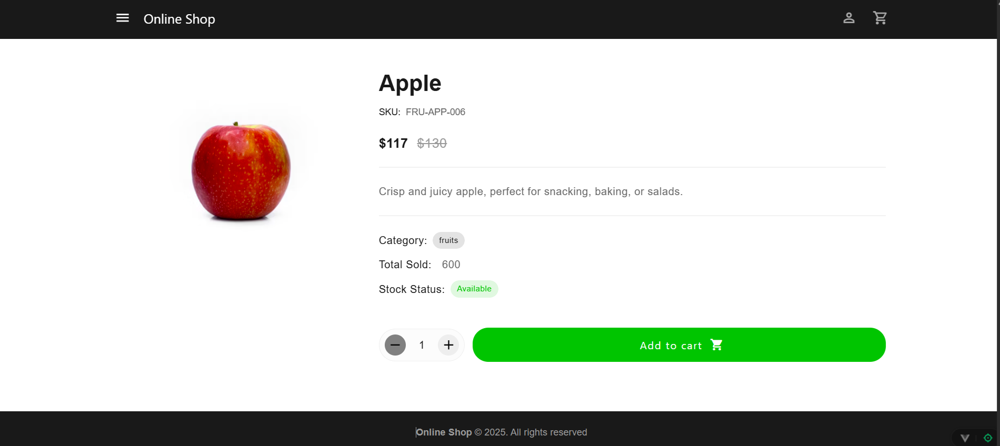
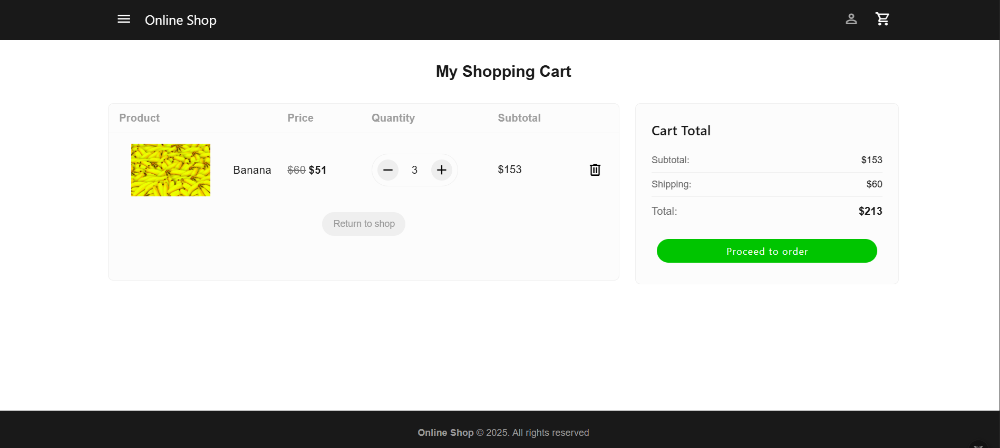
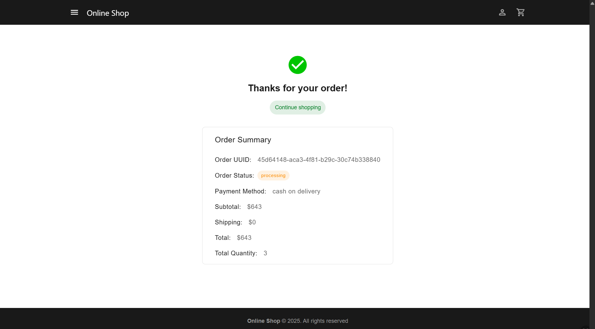

# Online Shop Frontend

This is a modern, responsive e-commerce frontend built with Vue 3, TypeScript, and Pinia. It features a complete user flow including authentication, product browsing and searching, shopping cart management, order tracking, payment , and user profile settings.

Website: <>

- Test account : test@gmail.com<br/>
- Test password : 12345678



## Highlight Features

### Register Page


### Login Page


### User Page


### Home Page


### Products Page


### Product Detail Page


### Cart Page


### Order Page


### Payment Page


### Order Detail Page



## Technology Stack

- **Framework**: Vue 3.5.18
- **State Management**: Pinia 3.0.3
- **Language**: TypeScript 5.8.0
- **Routing**: Vue Router 4.5.1
- **HTTP Client**: Axios 1.11.0
- **Form Validation**: VeeValidate 4.15.1 + Zod 3.23.8
- **UI Library**: Vuetify 3.9.5
- **Testing**: Vitest 3.2.4
- **Code Quality**: ESLint 9.31.0 + Prettier 3.6.2
- **Build Tool**: Vite 7.0.6
- **Containerization**: Docker + Ngnix

## Getting Start

### Prerequisites

- Node.js ^20.19.0 || >=22.12.0
- npm ^10.0.0

### Installation

1. Clone the repository:

```bash
git clone https://github.com/shu-ya318/online-shop-frontend.git
cd online-shop-frontend
```

2. Install dependencies:

```bash
npm install
```

3. Configure environment variables

   Create a `.env.development` file in the root of the project and add the following content. This file is ignored by Git.

   ```env
   VITE_API_BASE_URL=http://localhost:8081
   ```

### Development

Start the development server:

```bash
npm run dev
```

### Building

Production build:

```bash
npm run build
```

Build only (skip type checking):

```bash
npm run build-only
```

Preview build results:

```bash
npm run preview
```

### Containerization (Docker)

1.  Build the Docker image:

    ```bash
    docker build -t online-shop-frontend .
    ```

2.  Run the Docker container:

    ```bash
    docker run -d -p 5173:5173 --name online-shop-frontend-container online-shop-frontend
    ```

    This will start an Nginx server on port 5173. The application will be accessible at `http://localhost:5173`.

    **Note:** The Nginx configuration is set up to proxy API requests to a backend service. For this to work in a Docker environment, the frontend and backend containers should be on the same Docker network. It is recommended to use Docker Compose to orchestrate multi-container applications.

### Testing

Run unit tests:

```bash
npm run test:unit
```

### Code Quality

Type checking:

```bash
npm run type-check
```

Code linting:

```bash
npm run lint
```

Code formatting:

```bash
npm run format
```

## Project Structure

```
online-shop-frontend/
├── .env.development  # (Create this file locally, gitignored)
├── Dockerfile
├── nginx.conf
├── public/
├── src/
│   ├── __tests__/
│   ├── api/
│   │   ├── axios/
│   │   │   └── instance.ts
│   │   ├── cart/
│   │   │   ├── index.ts
│   │   │   └── interface.ts
│   │   ├── order/
│   │   │   ├── index.ts
│   │   │   └── interface.ts
│   │   ├── payment/
│   │   │   ├── index.ts
│   │   │   └── interface.ts
│   │   ├── product/
│   │   │   ├── index.ts
│   │   │   └── interface.ts
│   │   └── user/
│   │       ├── index.ts
│   │       └── interface.ts
│   ├── assets/
│   │   ├── base.css
│   │   ├── images/
│   │   └── main.css
│   ├── components/
│   │   ├── auth/
│   │   │   └── AuthFormCard.vue
│   │   ├── common/
│   │   │   ├── AddToCartControls.vue
│   │   │   ├── AppFooter.vue
│   │   │   ├── AppHeader.vue
│   │   │   ├── AppSidebar.vue
│   │   │   ├── CheckoutSummaryCard.vue
│   │   │   └── FormInput.vue
│   │   └── dashboard/
│   │       ├── cart/
│   │       │   └── CartList.vue
│   │       ├── home/
│   │       │   ├── BestSellerSection.vue
│   │       │   ├── CategoriesSection.vue
│   │       │   └── HomeBanner.vue
│   │       ├── order/
│   │       │   └── BillingInfo.vue
│   │       ├── product/
│   │       │   ├── FilterDropdowns.vue
│   │       │   ├── ProductCard.vue
│   │       │   └── SearchBar.vue
│   │       └── user/
│   │           ├── UserFormCard.vue
│   │           ├── UserOrderHistory.vue
│   │           └── UserSetting.vue
│   ├── composables/
│   │   └── useResponsiveCount.ts
│   ├── layouts/
│   │   ├── AuthLayout.vue
│   │   ├── DashboardLayout.vue
│   │   └── ErrorLayout.vue
│   ├── router/
│   │   └── index.ts
│   ├── stores/
│   │   ├── cartStore.ts
│   │   ├── notificationStore.ts
│   │   └── userStore.ts
│   ├── stylesheets/
│   │   └── theme.ts
│   ├── types/
│   │   └── common/
│   │       ├── enum.ts
│   │       └── interface.ts
│   ├── utils/
│   │   └── hasDiscount.ts
│   ├── views/
│   │   ├── auth/
│   │   │   ├── LoginView.vue
│   │   │   └── RegisterView.vue
│   │   ├── dashboard/
│   │   │   ├── CartView.vue
│   │   │   ├── HomeView.vue
│   │   │   ├── OrderDetailView.vue
│   │   │   ├── OrderView.vue
│   │   │   ├── ProductDetailView.vue
│   │   │   ├── ProductsView.vue
│   │   │   └── UserView.vue
│   │   └── ErrorView.vue
│   ├── App.vue
│   └── main.ts
├── .editorconfig
├── .gitattributes
├── .gitignore
├── .prettierrc.json
├── env.d.ts
├── eslint.config.ts
├── index.html
├── package.json
├── package-lock.json
├── README.md
├── tsconfig.json
├── tsconfig.app.json
├── tsconfig.node.json
├── tsconfig.vitest.json
├── vite.config.ts
└── vitest.config.ts
```

## Contact

- **Email**: shuyaHsieh318@gmail.com
- **Cake**: https://www.cake.me/me/shuyahsieh
- **Linkedin**: https://www.linkedin.com/in/%E6%B7%91%E9%9B%85-%E8%AC%9D-9906772b1/
