# Online Shop - Frontend

This is a e-commerce frontend built with Vue 3, TypeScript, and Pinia. It features a complete user flow including authentication, product browsing and searching, shopping cart management, order tracking, payment , and user profile settings.

**Demo Account:**
- Email: `test@gmail.com`
- Password: `12345678`

## Highlight Features

### Home Page
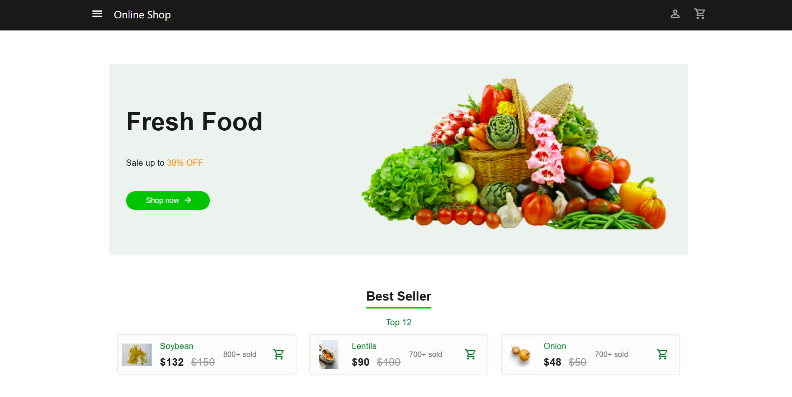

### Register Page
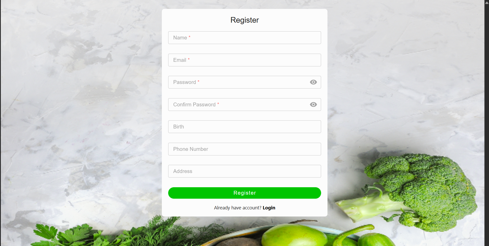

### Login Page
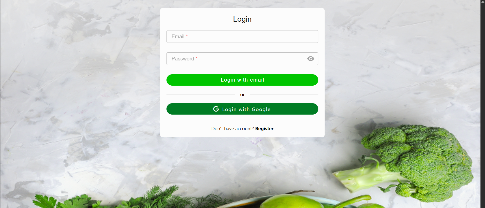

### User Page
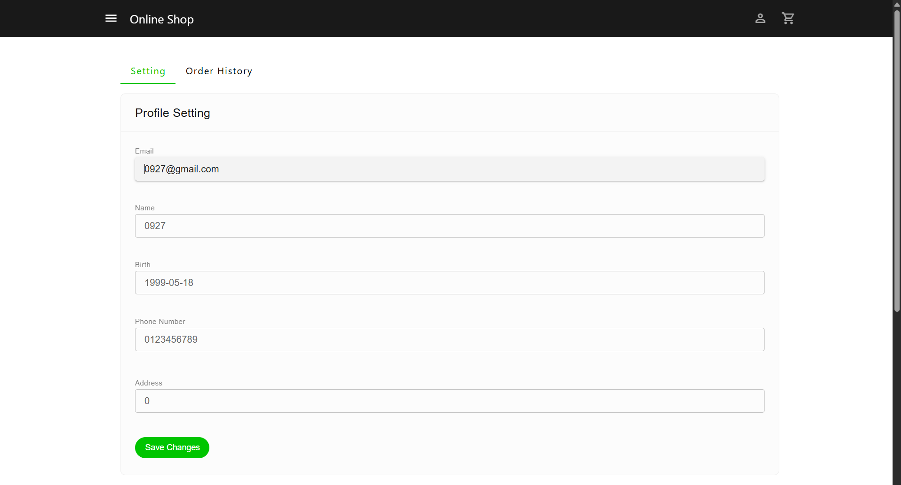

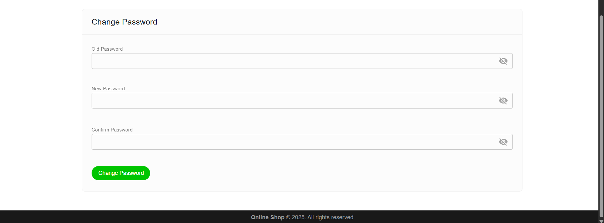

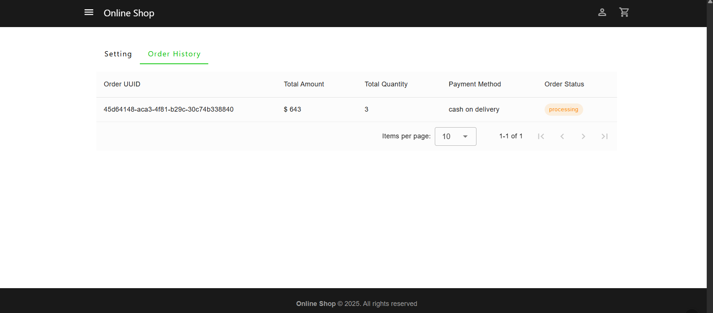

### Products Page
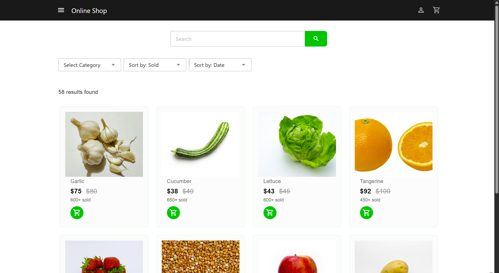

### Product Detail Page
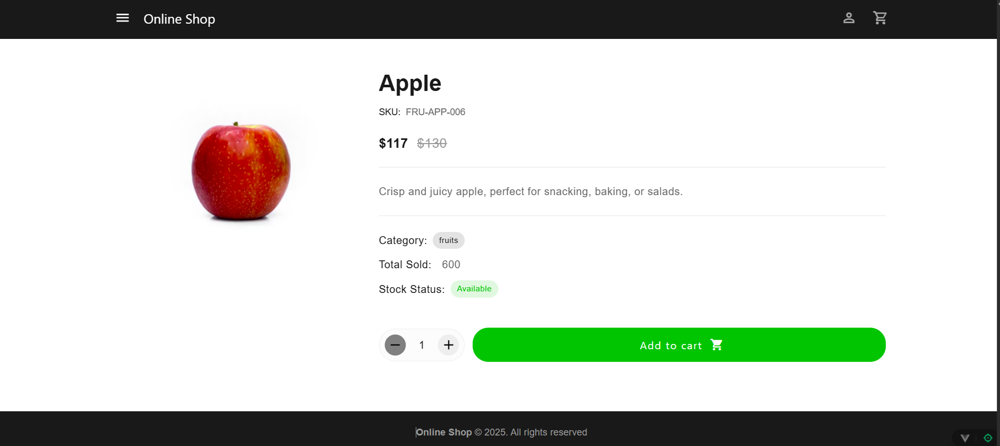

### Cart Page
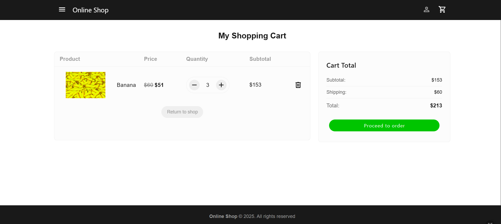

### Order Page
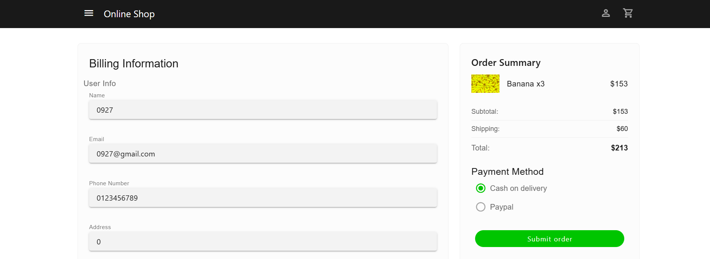

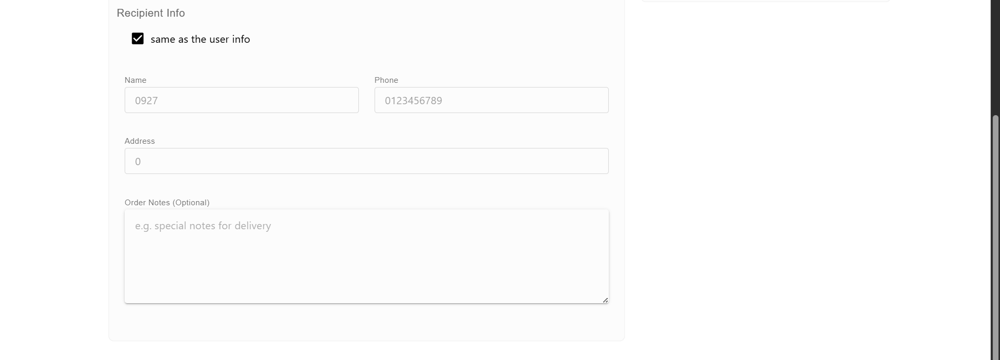

### Order Detail Page
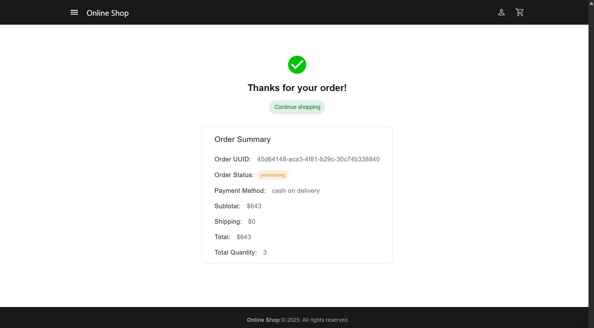

---

## Technology Stack

- **Framework**: Vue 3.5.18
- **State Management**: Pinia 3.0.3 + Persistedstate 4.5.0
- **Language**: TypeScript 5.8.0
- **Routing**: Vue Router 4.5.1
- **HTTP Client**: Axios 1.11.0
- **Form Validation**: VeeValidate 4.15.1 + Zod 3.23.8
- **UI Library**: Vuetify 3.9.5
- **Testing**: Vitest 3.2.4
- **Code Quality**: ESLint 9.31.0 + Prettier 3.6.2
- **Build Tool**: Vite 7.0.6
- **Containerization**: Docker + Nginx

## Getting Started

### Prerequisites
- Node.js `^20.19.0` or `>=22.12.0`
- npm `^10.0.0`

### Installation

1. **Clone the Repository**

    ```bash
    git clone https://github.com/shu-ya318/online-shop-frontend.git
    cd online-shop-frontend
    ```

2. **Install dependencies**

    ```bash
    npm ci
    ```

3. **Configure Environment Variables**

   Create a `.env.development` file in the root of the project and add the following content. This file is ignored by Git.

   ```env
   VITE_API_BASE_URL=http://localhost:8080
   ```

    > **Note:** You can change the port number (e.g., `http://localhost:9090`) to match your backend server configuration.


### Development

Start the development server:

```bash
npm run dev
```

> **Note:** The application will be available at `http://localhost:5173` (or the port shown in terminal).

### Deployment

1. **Build for Production**

    ```bash
    npm run build
    ```

    > **Note:** The built files will be output to the `dist/` directory.

2. **Deploy Static Files**

    The `dist/` directory can be served by any static file server:
    - Nginx
    - Apache  
    - Caddy
    - CDN/hosting services

3. **Containerization (Docker)**

    This project can also be deployed using Docker Compose from the parent directory. Please refer to the `docker-compose.yml` file in the parent directory for containerized deployment instructions.

    For standalone Docker deployment:

    ```bash
    # Build Docker image
    docker build -t online-shop-frontend:latest .
    
    # Run container
    docker run -d -p 80:80 \
      --name online-shop-frontend \
      online-shop-frontend:latest
    ```

    The application will be accessible at `http://localhost:80/`

    > **Note:** You can change the port mapping (e.g., `-p 3000:80`) to expose the application on a different host port.

### Code Quality

Type checking:

```bash
npm run type-check
```

Code linting:

```bash
npm run lint
```

Code formatting:

```bash
npm run format
```

## Project Structure

```
online-shop-frontend/
├── .env.development  # (Create this file locally, gitignored)
├── Dockerfile
├── .dockerignore
├── nginx.conf
├── public/
├── src/
│   ├── __tests__/
│   ├── api/
│   │   ├── axios/
│   │   │   └── instance.ts
│   │   ├── cart/
│   │   │   ├── index.ts
│   │   │   └── interface.ts
│   │   ├── common/
│   │   │   └── interface.ts
│   │   ├── order/
│   │   │   ├── index.ts
│   │   │   └── interface.ts
│   │   ├── payment/
│   │   │   ├── index.ts
│   │   │   └── interface.ts
│   │   ├── product/
│   │   │   ├── index.ts
│   │   │   └── interface.ts
│   │   └── user/
│   │       ├── index.ts
│   │       └── interface.ts
│   ├── assets/
│   │   ├── base.css
│   │   ├── images/
│   │   └── main.css
│   ├── components/
│   │   ├── auth/
│   │   │   └── AuthFormCard.vue
│   │   ├── common/
│   │   │   ├── AddToCartControls.vue
│   │   │   ├── AppFooter.vue
│   │   │   ├── AppHeader.vue
│   │   │   ├── AppSidebar.vue
│   │   │   ├── CheckoutSummaryCard.vue
│   │   │   └── FormInput.vue
│   │   └── dashboard/
│   │       ├── cart/
│   │       │   └── CartList.vue
│   │       ├── home/
│   │       │   ├── BestSellerSection.vue
│   │       │   ├── CategoriesSection.vue
│   │       │   └── HomeBanner.vue
│   │       ├── order/
│   │       │   └── BillingInfo.vue
│   │       ├── product/
│   │       │   ├── FilterDropdowns.vue
│   │       │   ├── ProductCard.vue
│   │       │   └── SearchBar.vue
│   │       └── user/
│   │           ├── UserFormCard.vue
│   │           ├── UserOrderHistory.vue
│   │           └── UserSetting.vue
│   ├── composables/
│   │   └── useResponsiveCount.ts
│   ├── layouts/
│   │   ├── AuthLayout.vue
│   │   ├── DashboardLayout.vue
│   │   └── ErrorLayout.vue
│   ├── router/
│   │   └── index.ts
│   ├── stores/
│   │   ├── cartStore.ts
│   │   ├── notificationStore.ts
│   │   └── userStore.ts
│   ├── stylesheets/
│   │   └── theme.ts
│   ├── types/
│   │   └── enum.ts
│   ├── utils/
│   │   └── hasDiscount.ts
│   ├── views/
│   │   ├── auth/
│   │   │   ├── LoginView.vue
│   │   │   └── RegisterView.vue
│   │   ├── dashboard/
│   │   │   ├── CartView.vue
│   │   │   ├── HomeView.vue
│   │   │   ├── OrderDetailView.vue
│   │   │   ├── OrderView.vue
│   │   │   ├── ProductDetailView.vue
│   │   │   ├── ProductsView.vue
│   │   │   └── UserView.vue
│   │   └── ErrorView.vue
│   ├── App.vue
│   └── main.ts
├── .editorconfig
├── .gitattributes
├── .gitignore
├── .prettierrc.json
├── env.d.ts
├── eslint.config.ts
├── index.html
├── package.json
├── package-lock.json
├── README.md
├── tsconfig.json
├── tsconfig.app.json
├── tsconfig.node.json
├── tsconfig.vitest.json
├── vite.config.ts
└── vitest.config.ts
```
